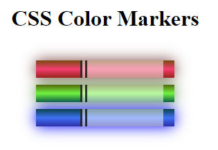

# In making this webpage, I learned:

1. basic color theory - how to highlight certain elements of webpages through colors
2. inputting colors through rgb and hsl functions as well as hex codes
3. linear gradients
4. shadows
5. opacity and alpha forms of rgb, hsl and hex

  
   
  <em>Preview of the webpage</em>

